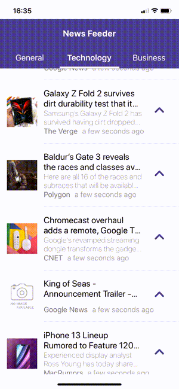

## NewsFeed - React Native Demo application

This application was done to showcase and learn how to use some components and to consume JSON from an API. The Chosen Api was the [NewsAPI](https://newsapi.org), an API with live news and blog articles. I've used various components from [Native Base] (https://newsapi.org), that provides "Essential cross-platform UI components for React Native & Vue Native", the [React Native WebView](https://github.com/react-native-webview/react-native-webview) - "a Modern, Cross-Platform WebView for React Native"

The app seems to be simple, but "under-the-hood" it has some good stuff. I've used the concept of components and arrow functions as much as possible. Some CocoaPods had to be installed for the iOS Version and some Maven libraries for the Android Platform, too.

### The Application:
The App's UI Consists of a Tabbed View, with three Tabs: General, Technology and Business, for each Category of News.

The user choose a Category and the News for that will be fetched in a FlatList, with a Thumbnail. If the user wants to read a certain news, he just has to click on the arrow, on the right side of the row and a Modal View will be presented, showing the complete news.
If he wants to share this news, it's just to click on the symbol for that in the right side of the Navigation Bar. The news can be shared by numerous ways (AirDrop, Facebook, Messenger, Twitter, WhatsApp, Mail, Messages, LinkedIn, Skype, etc).

### Packages used:

- [Native Base] (https://newsapi.org) - TabView, ListThumbnail, Thumbnail, Icons
- [React Native WebView](https://github.com/react-native-webview/react-native-webview) - WebView for the ModalView

### Demo

- News Feed App

- Sharing News

### Directions:
- You need to obtain a key (it's free) in the [News API Site](https://newsapi.org);

- Once you get it, go to source => config => apiSettings.js and insert it in the first line, where is written 'Put your key here!';

- Tested in iOS simulators for iPhoneXR and 11 and in real devices iPhone6 and iPhone11. 
